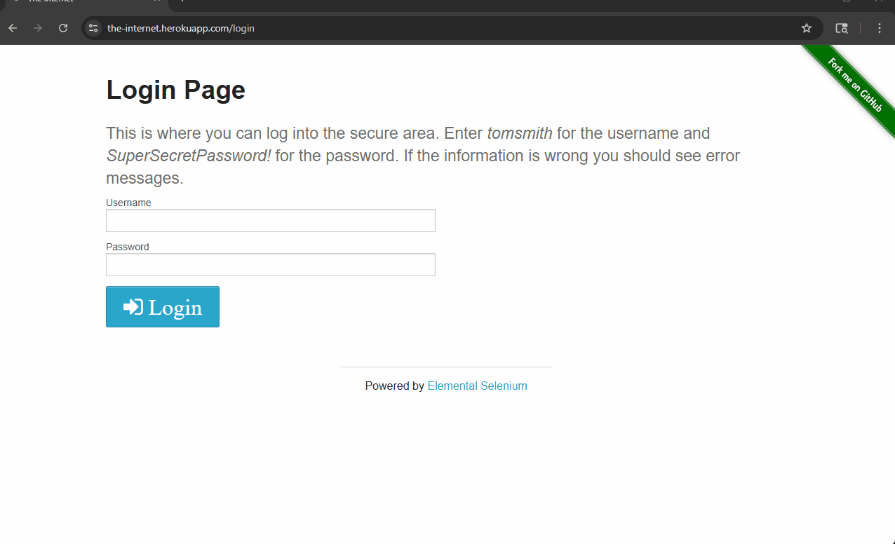
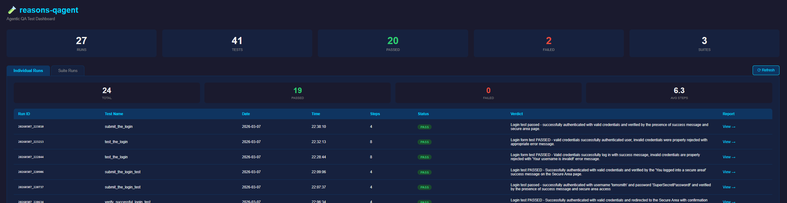
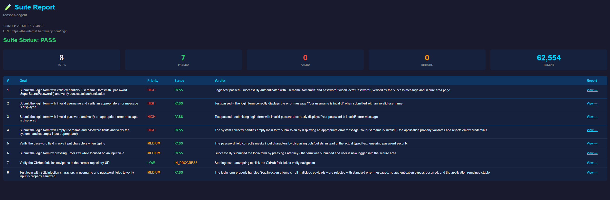

# reasons-qagent 🧪



## Dashboard


## Sample Report


An agentic QA testing tool powered by Claude AI and Playwright.

## What it does
- Launches a real browser and navigates to a target URL
- Takes screenshots at every step
- Sends each screenshot to Claude with a test goal
- Claude decides what to do next — click, type, navigate, or conclude
- Saves timestamped JSON and HTML reports with pass/fail verdicts
- Dashboard to view all past test runs

## How it works
The core loop:
1. Browser takes action
2. Screenshot captured
3. Claude analyzes screenshot and decides next action
4. Repeat until goal is complete or step limit reached

## Project Structure
```
reasons-qagent/
├── tests/
│   ├── agent_test.py      # Main agentic test runner
│   └── test_login.py      # Simple single-run test
├── screenshots/           # Per-step screenshots (auto-generated)
├── reports/               # JSON + HTML reports (auto-generated)
├── dashboard.html         # Visual report dashboard
├── build_index.py         # Indexes reports for dashboard
├── .env                   # API key (never committed)
├── .env.example           # Env variable template
└── README.md
```

## Setup

**1. Clone the repo**
```bash
git clone https://github.com/yourusername/reasons-qagent.git
cd reasons-qagent
```

**2. Create virtual environment**
```bash
python -m venv venv
venv\Scripts\activate        # Windows
source venv/bin/activate     # Mac/Linux
```

**3. Install dependencies**
```bash
pip install anthropic playwright python-dotenv
playwright install chromium
```

**4. Add your API key**
```bash
cp .env.example .env
# Edit .env and add your Anthropic API key
```

## Running a test
```bash
python tests/agent_test.py
```

## Viewing reports
```bash
python build_index.py
python -m http.server 8000
# Open http://localhost:8000/dashboard.html
```

## Tech Stack
- [Claude API](https://anthropic.com) — AI decision making
- [Playwright](https://playwright.dev) — Browser automation
- [Python](https://python.org) — Core language

## Status
Active development. Built as a portfolio project exploring agentic QA workflows.